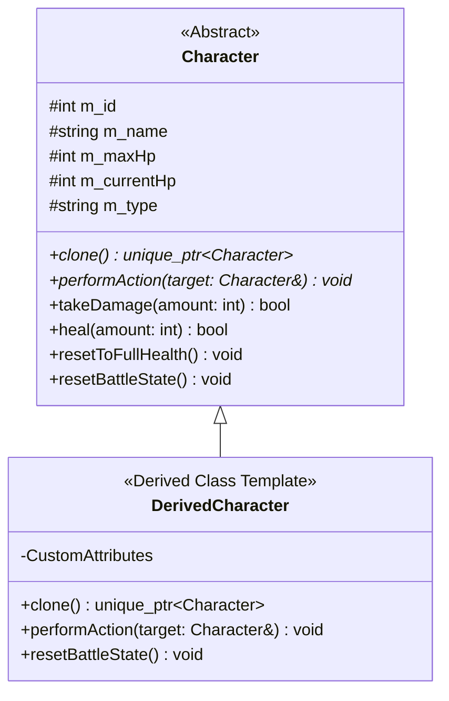

# QUY TẮC VÀ THIẾT KẾ KIẾN TRÚC LỚP NHÂN VẬT (CHARACTER DESIGN SPECIFICATION)

Tài liệu này tổng hợp toàn bộ quy tắc, luật thiết kế, invariant và chuẩn mực mở rộng cho hệ thống lớp nhân vật trong **Turn-Based Adventure Game**. Tài liệu dùng làm chuẩn tham chiếu khi nâng cấp hoặc tạo thêm các lớp nhân vật mới.

---

## 1. TỔNG QUAN KIẾN TRÚC

Hệ thống nhân vật tuân thủ mô hình **Đa hình (Polymorphism)**, **Pattern Prototype (`clone()`)** và **Smart Pointers (`std::shared_ptr`, `std::unique_ptr`)**:

---

## 2. QUY TẮC LỚP CƠ SỞ `Character` (BASE CLASS INVARIANTS)

Lớp `Character` là lớp cơ sở thuần ảo (Abstract Base Class), quản lý các thuộc tính dùng chung và bảo toàn các ràng buộc dữ liệu:

### 2.1. Các Thuộc Tính Dùng Chung
- `m_id` (`int`): ID định danh duy nhất (`m_id > 0`).
- `m_name` (`std::string`): Tên nhân vật (không được rỗng sau khi trim).
- `m_maxHp` (`int`): Máu tối đa (`m_maxHp > 0`).
- `m_currentHp` (`int`): Máu hiện tại (`0 <= m_currentHp <= m_maxHp`).
- `m_type` (`std::string`): Chuỗi định danh loại nhân vật dạng viết hoa duy nhất (ví dụ: `"WARRIOR"`, `"MAGE"`).

### 2.2. Phương Thức Thuần Ảo (Pure Virtual Methods)
Mọi lớp dẫn xuất **BẮT BUỘC** phải triển khai:
1. `virtual std::unique_ptr<Character> clone() const = 0;`
   - Tạo bản sao sâu (deep copy) của đối tượng.
   - Phải tạo mới một đối tượng bằng `std::unique_ptr<Character>(new Derived(*this))`.
2. `virtual void performAction(Character& target) = 0;`
   - Thực hiện hành động trong lượt đấu đối với mục tiêu.

### 2.3. Quy Tắc Bảo Toàn Trạng Thái (Invariants & Clamping)
- `takeDamage(amount)`: Giảm HP, không giảm xuống dưới 0. Bỏ qua nếu `amount <= 0`.
- `heal(amount)`: Tăng HP, không vượt quá `maxHp`. Bỏ qua nếu `amount <= 0`.
- `isAlive()`: Trả về `true` khi `m_currentHp > 0`.
- `resetToFullHealth()`: Đặt `m_currentHp = m_maxHp`.
- `resetBattleState()`: Mặc định gọi `resetToFullHealth()`. Nếu lớp con có tài nguyên phụ (như Mana/Energy) thì cần override để khôi phục cả tài nguyên phụ đó.

---

## 3. QUY TẮC NGUYÊN TẮC THIẾT KẾ LỚP DẪN XUẤT (DERIVED CLASS RULES)

### 3.1. Đặt Tên & Loại Nhân Vật
- Tên lớp trong C++: Chuẩn **PascalCase** (ví dụ: `Warrior`, `Mage`).
- Tên loại `m_type` truyền cho constructor lớp cha: Chuẩn **UPPERCASE** (ví dụ: `"WARRIOR"`, `"MAGE"`).

### 3.2. Triển Khai Phương Thức Hành Động (`performAction`)
1. **Kiểm tra trạng thái sống**: Đầu hàm phải kiểm tra `if (!isAlive() || !target.isAlive()) return;`.
2. **Quản lý tài nguyên riêng (nếu có)**:
   - Đủ tài nguyên: Trừ tài nguyên và thi triển kỹ năng chính (sát thương/hồi máu/hiệu ứng).
   - Không đủ tài nguyên: Thực hiện hành động dự phòng (fallback/đánh thường).

### 3.3. Đóng Gói Và Truy Vấn Dữ Liệu (Encapsulation)
- Thuộc tính riêng phải khai báo `private`.
- Mọi hàm setter phải validate dữ liệu (ví dụ: chỉ chấp nhận giá trị `> 0`).
- Getter và phương thức truy vấn trạng thái phải được đánh dấu `const`.

---

## 4. QUY TẮC PERSISTENCE (LƯU TRỮ VÀ ĐỌC/GHI FILE)

Mọi lớp nhân vật đều phải được tích hợp vào `DataFileManager` theo định dạng **Pipe-Separated (`|`)**.

### 4.1. Chuẩn Định Dạng File (`data/characters.txt`)
Cấu trúc chung:
`TYPE|id|name|maxHp|[các_thuộc_tính_riêng_tương_ứng_theo_thứ_tự]`

### 4.2. Quy Tắc Validation Khi Parsing (`DataFileManager::parseCharacterLine`)
1. Bỏ qua dòng rỗng hoặc dòng comment (bắt đầu bằng `#`).
2. Tách chuỗi theo dấu `|`.
3. Kiểm tra token loại (`TYPE`).
4. Kiểm tra đúng số lượng token mong đợi.
5. Kiểm tra định dạng số nguyên cho tất cả trường kiểu số bằng `Utils::isInteger()`.
6. Kiểm tra điều kiện hợp lệ (`id > 0`, `name` không rỗng, các tham số `> 0`).
7. Trả về `std::make_shared<DerivedClass>(...)` nếu hợp lệ, ngược lại trả về `nullptr`.

### 4.3. Quy Tắc Serialization (`DataFileManager::serializeCharacter`)
1. Kiểm tra đối tượng hợp lệ (`id > 0`, `name` không rỗng, `maxHp > 0`).
2. Ép kiểu an toàn bằng `dynamic_cast<const DerivedClass*>(&character)`.
3. Trả về chuỗi định dạng đầy đủ các trường nối bằng dấu `|`.

---

## 5. QUY TẮC GIAO DIỆN CONSOLE UI (`Menu`)

Khi thêm lớp nhân vật mới, cần cập nhật module `Menu`:
1. **Việt hóa tên loại**: Cập nhật hàm `characterTypeToVietnamese()` để trả về tên hiển thị Tiếng Việt tương ứng với `m_type`.
2. **Hiển thị dòng chi tiết (`printCharacterRow`)**: Ép kiểu `dynamic_cast` lấy các tham số riêng để điền vào các cột thông số trên bảng điều khiển.

---

## 6. QUY TẮC QUẢN LÝ BỘ NHỚ VÀ ĐỘC LẬP TRẬN ĐẤU

1. **Roster (`CharacterRoster`)**: Quản lý các nhân vật gốc bằng `std::shared_ptr<Character>`. Đảm bảo tính duy nhất của ID.
2. **Battle Engine (`BattleEngine`)**: Sử dụng phương thức `.clone()` để nhân bản đối tượng trước khi đưa vào trận đấu. Mọi thay đổi trong trận đấu (máu, mana, tử vong) hoàn toàn không ảnh hưởng đến dữ liệu nhân vật gốc trong Roster.

---

## 7. QUY TRÌNH CHECKLIST KHI THÊM LỚP NHÂN VẬT MỚI

Khi nhận yêu cầu triển khai lớp nhân vật mới, tiến hành theo đúng các bước sau:

1. **Domain Model**:
   - [ ] Tạo file header `include/<Class>.h` kế thừa `Character`.
   - [ ] Tạo file source `src/<Class>.cpp` triển khai `clone()`, `performAction()`, `resetBattleState()`, và các getter/setter.
2. **Persistence Layer**:
   - [ ] Cập nhật `DataFileManager::parseCharacterLine()` cho loại nhân vật mới.
   - [ ] Cập nhật `DataFileManager::serializeCharacter()` cho loại nhân vật mới.
3. **UI Layer**:
   - [ ] Cập nhật `characterTypeToVietnamese()` trong `Menu.cpp`.
   - [ ] Cập nhật `printCharacterRow()` trong `Menu.cpp`.
4. **Roster & App Orchestration**:
   - [ ] Thêm phương thức tạo/thêm nhân vật mới trong `CharacterRoster` và `GameApp`.
5. **Testing**:
   - [ ] Thêm Unit Tests kiểm thử khởi tạo, biến đổi trạng thái, parse/serialize và trận đấu trong `tests/RunAllTests.cpp`.
